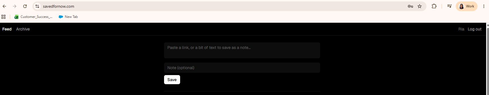
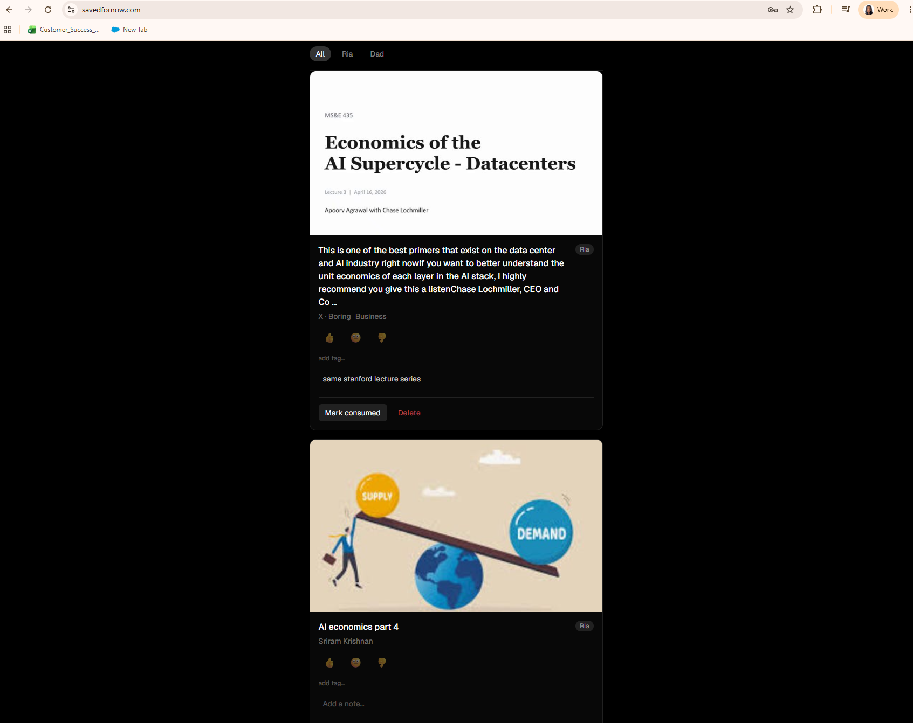
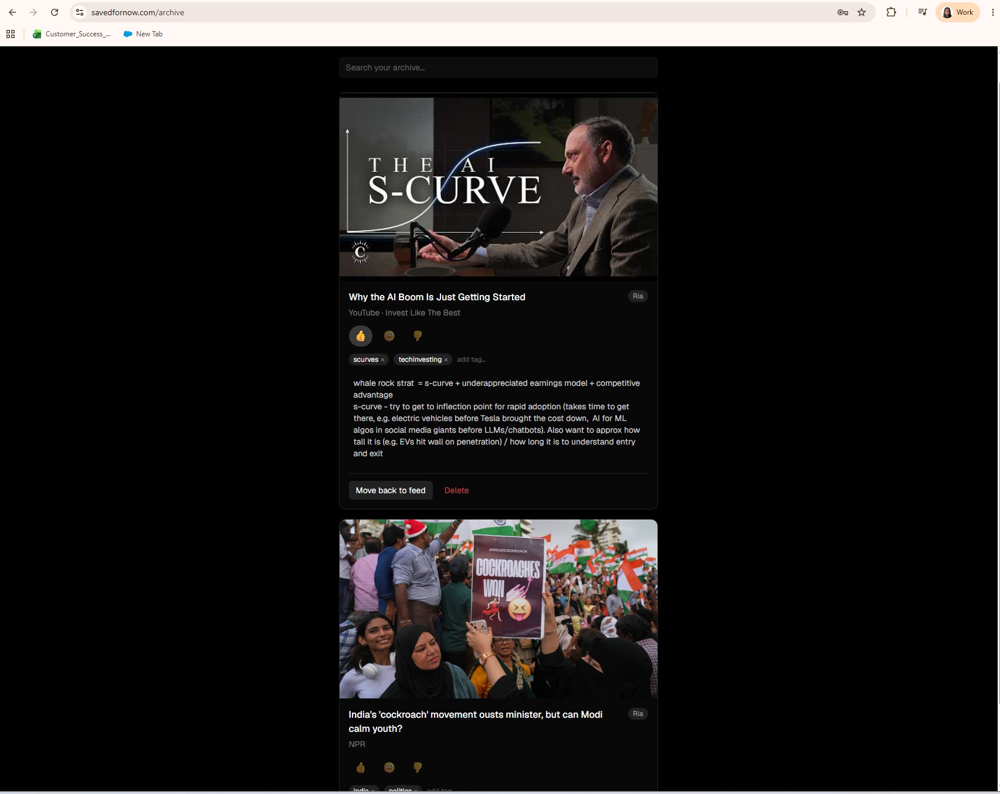

# Saved For Now

A private "read it later" feed — email or paste something in (a link, a PDF,
a tweet, or just plain text) and it's there later, ready to go through when
you actually have time for it.

**Live:** [savedfornow.com](https://savedfornow.com) (login-gated — built for,
and currently used by, myself and my dad, but fully deployed and running)

Instead of doomscrolling social media on my commute or whenever I have a
spare moment, I wanted to go through a feed of content I'd been meaning to
get back to instead — and not just tweets, anything I want to consume later.
My dad and I also send each other articles and links constantly over text
and email, and there was never one place to keep track of what we'd shared
or say what we thought of it. This is that place: email or paste something
in, and it's there later, with room for each person to react to it
independently.

## How it works

**1. Save something** — email a link to a dedicated inbox, or paste it (or
any text) straight into the site.



**2. It shows up with a real preview, ready to react to** — title, image, and
site name fetched automatically (including for sites that block plain
scraping, like YouTube and X/Twitter, via their oEmbed APIs, and PDFs via
their metadata). Each person has their own tags/reaction/read-status on the
same shared item, while comments are shared and visible to everyone.



**3. Mark it consumed** — it drops out of your feed and into your own
searchable archive.



## Under the hood

```
Email → Cloudflare Email Routing → Cloudflare Worker (parses MIME, extracts
  sender/links) → Next.js API route (matches sender to a known person, saves
  the item) ─┐
             ├─→ Neon Postgres (via Drizzle ORM)
Paste box ───┘
```

- **Auth** is deliberately minimal: two known people, two passwords, a signed
  JWT cookie — no accounts system, since there will only ever be two users.
- **Data model** separates shared content (`items`: the URL/text, title,
  image) from per-person state (`item_interactions`: tags, reaction, comment,
  consumed), so two people independently interact with one shared row.

**Stack:** Next.js (App Router) · TypeScript · Tailwind · Drizzle ORM · Neon ·
Cloudflare Workers + Email Routing · Vercel

## Local development

```bash
npm install
cp .env.local.example .env.local   # fill in your own Neon DB, auth secret, passwords
npm run db:push                    # push the schema to your database
npm run dev
```

The email-ingest path (`cloudflare-worker/`) is a separate small project — see
its `wrangler.toml` for the Worker config, deployed independently via
`wrangler deploy`.
